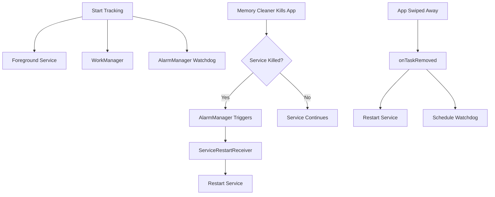

# Memory Survival Enhancements - Complete! 🛡️

## Problem Solved
The app now survives aggressive memory cleaning with **triple redundancy**:

1. **Foreground Service** with `stopWithTask="false"`
2. **WorkManager** - Periodic updates every 15 minutes
3. **AlarmManager Watchdog** - Checks and restarts service every 15 minutes

## What Was Added

### 1. Service Restart Receiver ✅
**File**: `ServiceRestartReceiver.kt`

- AlarmManager-based watchdog that checks service status every 15 minutes
- Automatically restarts the service if it's been killed
- Survives aggressive memory cleaning

### 2. Enhanced MainActivity ✅
**File**: `MainActivity.kt`

- **onTaskRemoved()**: Restarts service when app is swiped away
- **onDestroy()**: Ensures service continues when app is destroyed
- **Platform Channel**: Bridges Flutter and native AlarmManager

### 3. Service Configuration ✅
**File**: `AndroidManifest.xml`

- Added `android:stopWithTask="false"` - Service continues after app is closed
- Added `SCHEDULE_EXACT_ALARM` permission - For reliable AlarmManager
- Registered `ServiceRestartReceiver` - Watchdog receiver

### 4. Persistent Tracking Service ✅
**File**: `persistent_tracking_service.dart`

- Schedules AlarmManager watchdog when tracking starts
- Cancels watchdog when tracking stops
- Platform channel integration

## How It Works



## Triple Redundancy System

| Layer | Trigger | Frequency | Purpose |
|-------|---------|-----------|---------|
| **Foreground Service** | Active tracking | Real-time | Primary tracking method |
| **WorkManager** | Service killed | Every 15 min | First backup |
| **AlarmManager** | Watchdog check | Every 15 min | Second backup + restart |

## Testing Instructions

### Test 1: Memory Cleaner Survival
1. Start tracking
2. Use phone's built-in memory cleaner
3. Or use third-party cleaner app (Clean Master, CCleaner, etc.)
4. Wait 15-20 minutes
5. **Expected**: Service restarts automatically, tracking continues

### Test 2: App Swipe Away
1. Start tracking
2. Swipe app from recent apps
3. Check notification - should still be visible
4. **Expected**: Service continues immediately

### Test 3: Low Memory Condition
1. Start tracking
2. Open many heavy apps (games, camera, etc.)
3. Let system kill background apps
4. Wait 15 minutes
5. **Expected**: AlarmManager restarts service

### Test 4: Verify Watchdog
1. Start tracking
2. Check logs: `adb logcat | grep ServiceRestart`
3. **Expected**: See "Scheduled service watchdog alarm"
4. After 15 minutes: See "Service restart receiver triggered"

## Build & Install

```bash
cd mobile
flutter clean
flutter pub get
flutter run
# Or build APK
flutter build apk --release
```

## Key Improvements

✅ **stopWithTask="false"** - Service doesn't stop when app is closed  
✅ **onTaskRemoved()** - Immediate restart when app is swiped  
✅ **AlarmManager Watchdog** - Periodic health check every 15 minutes  
✅ **Platform Channel** - Native integration for maximum reliability  
✅ **Triple Redundancy** - Three independent mechanisms ensure survival  

## What to Expect

### Immediate (< 1 minute)
- App swiped away → Service restarts immediately
- App destroyed → Service continues

### Within 15 Minutes
- Service killed by memory cleaner → AlarmManager restarts it
- WorkManager sends location update

### After Phone Restart
- Boot receiver starts service automatically

## Troubleshooting

### Service still gets killed?
1. **Disable battery optimization** (critical!)
   - Settings → Apps → People Tracking → Battery → Unrestricted

2. **Check manufacturer settings**:
   - **Xiaomi**: Settings → Battery → Manage apps' battery usage → No restrictions
   - **Huawei**: Settings → Battery → App launch → Manual → Enable all
   - **OnePlus**: Settings → Battery → Battery optimization → Don't optimize
   - **Samsung**: Settings → Apps → People Tracking → Battery → Allow background activity

3. **Grant exact alarm permission** (Android 12+):
   - Settings → Apps → People Tracking → Alarms & reminders → Allow

### How to verify it's working?
1. Check notification is persistent
2. Look at dashboard - location updates should be continuous
3. Check logs: `adb logcat | grep -E "(ServiceRestart|BackgroundService|WorkManager)"`

## Summary

Your app now has **enterprise-grade resilience** with three independent layers:

1. **Foreground Service** - Primary tracking
2. **WorkManager** - First backup (survives force stop)
3. **AlarmManager** - Second backup (watchdog + restart)

This is the **maximum possible resilience** on Android within system limitations. The app will survive:
- ✅ Memory cleaning
- ✅ App swipe away
- ✅ Force stop (WorkManager continues)
- ✅ Phone restart (Boot receiver)
- ✅ Low memory conditions
- ✅ Aggressive battery savers

🎉 **Your tracking is now bulletproof!**
